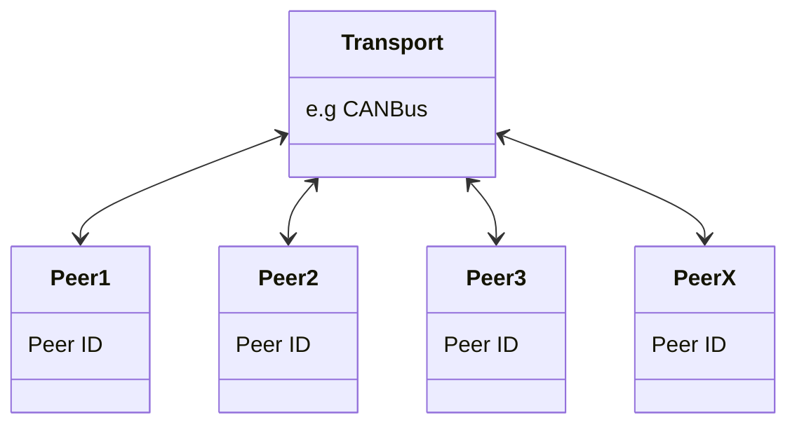

# DroneCAN

### Sam Log
**29/03/23**
- Downloading and testing DroneCAN GUI tool 
- Setting up Github repositories
- Researching best ways to get started developing DroneCAN for STM32
- Joined DroneCAN Discord

**30/03/23**
- Researching DroneCAN documentation
- Writing introduction README


# What is DroneCAN?
[DroneCAN](https://dronecan.github.io) (previously known as UAVCAN) is a modern, light-weight, decentralised protocol aimed at UAV's, robotics and space applications. The standard primarily communicate via CAN bus and has popular commercial support from leading UAV flight controller projects such as [Ardupilot](https://ardupilot.org) and [PX4](https://px4.io). 


## Where does DroneCAN fit within the serial protcol space
DroneCAN is a continuation of the previously known UAVCAN project (UAVCAN was also forked and extended into a competing protocol known as [Cyphal](https://opencyphal.org) - *see below*). In industrial application DroneCAN competes with other established communication protocols such as [MODBUS](https://modbus.org), and for robotics applications it competes with [ROS](https://www.ros.org).


*Credit https://zubax.com/technologies/cyphal*

Cypyhal has many similarities to DroneCAN, and is also supported by the [PX4](https://px4.io) autopilot hardware), but it extends beyond DroneCAN's capabilities by including more robust messaging features that are more suited to complex projects, and which more closely align to the [Decentralied Publish Subscribe Standard (DCPS)](https://opendds.org/documents/architecture.html). Cyphal also supports more message transport mechanisms beyond just CAN, such as TCP and UDP. 
For more information on the differences between DroneCAN and Cyphal, [see here](https://forum.opencyphal.org/t/cyphal-vs-dronecan/1814).

## DroneCAN transport technologies
DroneCAN is primarily CAN and CAN-FD based, but it can be used succesfully with other transports including Ethernet and Serial. 

## DroneCAN Network Architecture
DroneCAN is a decentralised peer network where each peer (node) can speak with every other peer
on the network through a publish/subscribe architecture. Each peer has a unique numeric ID (known as the peer ID).



### DroneCAN types of communication
DroneCAN nodes supports 2 types of communication:
- **Message broadcasting** - The primary method of data exchange with publish/subscribe semantics.
- **Service invocation** - The communication method for peer-to-peer request/response interactions.


# DroneCAN Official support
**DroneCAN official Github repository** https://github.com/dronecan  
## DroneCAN tutorials
https://dronecan.github.io/Implementations/Libuavcan/Tutorials/  

## Official software libraries 

### Official DroneCAN C library (libcanard)
https://github.com/dronecan/libcanard 

### Official DroneCAN Python library (pyuavcan)
https://github.com/dronecan/pydronecan 

## DroneCAN GUI tool

https://github.com/DroneCAN/gui_tool 

### DroneCAN GUI tool Ubuntu instructions
```
sudo apt-get install -y python3-pip python3-setuptools python3-wheel
sudo apt-get install -y python3-numpy python3-pyqt5 python3-pyqt5.qtsvg git-core
sudo pip3 install git+https://github.com/DroneCAN/gui_tool@master
```
^^ Tested working on Ubuntu Parallels ARM64 29/03/23 SW


> ### DroneCAN GUI tool MacOS instructions (FAILED ON M1 IGNORE)
> 1. Download and install homebrew from https://brew.sh 
> 2. Execute the following commands:
> ```
>    brew install python3
>    brew postinstall python3
>    arch -arm64 brew install pyqt@5
>    arch -arm64 pip3 install git+https://github.com/DroneCAN/gui_tool@master
>    dronecan_gui_tool
>```
