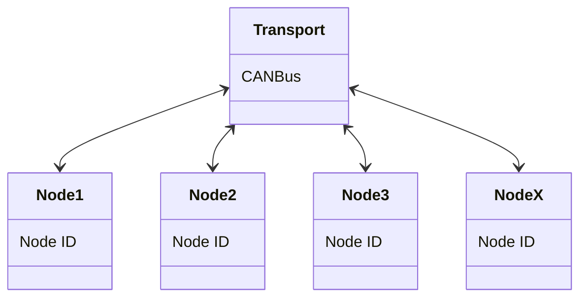
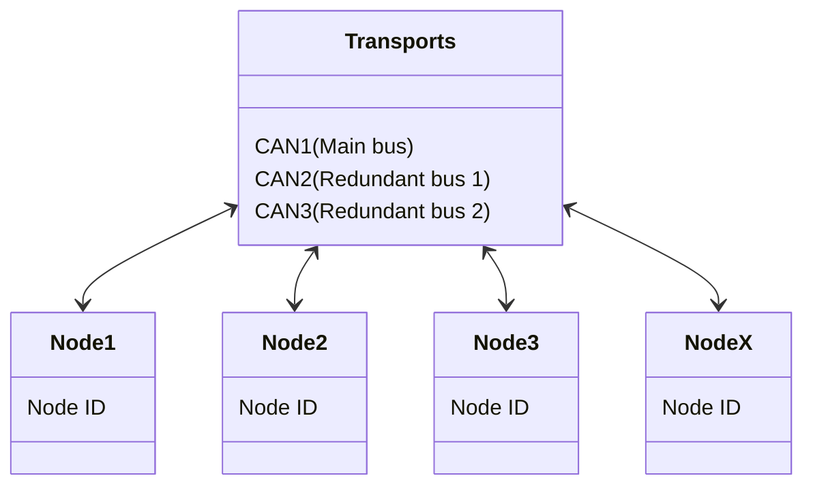
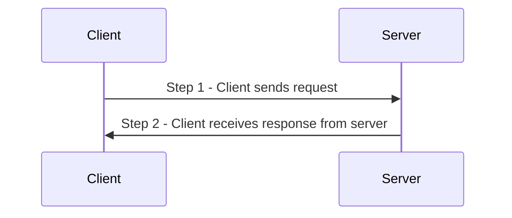

# DroneCAN

### Sam Log
**29/03/23**
- Downloading and testing DroneCAN GUI tool 
- Setting up Github repositories
- Researching best ways to get started developing DroneCAN for STM32
- Joined DroneCAN Discord

**30/03/23**
- Researching DroneCAN documentation
- Writing introduction README

**31/03/23**
- Continuing researching DroneCAN documentation
- Cotinuing writing introduction README


# What is DroneCAN?
[DroneCAN](https://dronecan.github.io) (previously known as UAVCAN) is a modern, light-weight, decentralised protocol aimed at UAV's, robotics and space applications. The standard primarily communicate via CAN bus and has popular commercial support from leading UAV flight controller projects such as [Ardupilot](https://ardupilot.org) and [PX4](https://px4.io). DroneCAN is published under the [MIT License](http://en.wikipedia.org/wiki/MIT_License).


## Where does DroneCAN fit within the serial protcol space
DroneCAN is a continuation of the previously known UAVCAN project (UAVCAN was also forked and extended into a competing protocol known as [Cyphal](https://opencyphal.org) - *see below*). In industrial application DroneCAN competes with other established communication protocols such as [MODBUS](https://modbus.org), and for robotics applications it competes with [ROS](https://www.ros.org).


*Credit https://zubax.com/technologies/cyphal*

Cypyhal has many similarities to DroneCAN, and is also supported by the [PX4](https://px4.io) autopilot hardware), but it extends beyond DroneCAN's capabilities by including more robust messaging features that are more suited to complex projects, and which more closely align to the [Decentralied Publish Subscribe Standard (DCPS)](https://opendds.org/documents/architecture.html). Cyphal also supports more message transport mechanisms beyond just CAN, such as TCP and UDP. 
For more information on the differences between DroneCAN and Cyphal, [see here](https://forum.opencyphal.org/t/cyphal-vs-dronecan/1814).

## DroneCAN transport technologies
DroneCAN is primarily CAN and CAN-FD based, but it can be used succesfully with other transports including Ethernet and Serial. 

## DroneCAN Network Architecture
DroneCAN is a decentralised peer network where each peer (node) can speak with every other peer
on the network through a publish/subscribe architecture. Each peer has a unique numeric ID (known as the node ID).



DroneCAN operates as a **democratic network**, where each node shares equal communication rights, eliminating the dependency on a central master node. This approach distributes authority across the entire network, reducing the risk of a single point of failure and improving overall stability.

DroneCAN also support the use of up to 3 redundant busses. This feature allows mission critical nodes to be connected to their own backup communication busses in case of failures on the main bus. **Note that all nodes must be be connected to the main bus**, but only the nodes that the user requires to redundany for need to be connected to the redundant bus lines. It is also possible to connect all nodes to all bus channels to enable redundancy for all nodes in the network. 



### DroneCAN types of communication
DroneCAN nodes supports 2 types of communication:
- **Message broadcasting** - The primary method of data exchange with publish/subscribe semantics.
- **Service invocation** - The communication method for peer-to-peer request/response interactions.

### DroneCAN Data Structures
Each communication method has its own types of pre-defined data structures, each with their own "Data Type ID" or (DTID). The standard includes its own DTID's which are suggested for most use cases, but custom types can be produced by each vendor. The message and service data structures are defined by the [The Data Structure Description Language (DSDL)](https://dronecan.github.io/Specification/3._Data_structure_description_language). The DSDL  generates the message serialisation and deserialisation code optimised for each target platform and programming language (e.g., C or Python).

The DSDL also includes various standard high-level functions such as firmware update, time synchonisation, network discovery and node health monitoring ([for more information see here](https://dronecan.github.io/Specification/6._Application_level_functions/)).

These serialised messages are then sent through the [CAN transport layer](https://dronecan.github.io/Specification/4._CAN_bus_transport_layer/) which automatically handles splitting larger messages into multiple frames.

## Message Broadcasting 
This is the primary communication method for DroneCAN. Messages are published (broadcasted) by each node, on a regular or ad-hoc basis and are received by relevant subscribers. Examples of message broadcasting are sending velocity commands to motors or updating temperatures from sensors. 

Each broadcast message includes the following information:

| Field | Content |
| --- | --- |
| `Payload` | The serialised data structure |
| `Data type ID` | Numerical indicator showing how the message should be interpreted |
| `Source node ID` | The node ID of the transmitting node |
| `Transfer ID`|An small overflowing integer that increments each time a given message is sent by the node |

### Anonymous message broadcasting
It is also possible to send anonymous messages with no `Source node ID`. This is particularly useful if node ID's are allocated dynamically upon being initialised on the network. 

## Service invocation
Service invocation only happens between 2 nodes (a client and a server). This occurs in a 2 step exchange:

Examples of service communication include firmware updating, file transfers and other ad-hoc action requests. 

Each service invocation includes the following information:

| Field | Content |
| --- | --- |
| `Payload` | The serialised data structure |
| `Data type ID` | Numerical indicator showing how the message should be interpreted |
| `Client node ID` | Source node ID during request transfer, destination node ID during response transfer |
| `Server node ID` | Destination node ID during request transfer, source node ID during response transfer |
| `Transfer ID`|An small overflowing integer that increments each time a given message is sent by the node |

Both request and response contain exactly the same values for all fields except payload, where the content is application defined. Clients can match the response with a corresponding request using the following fields: data type ID, client node ID, server node ID, and transfer ID.
For more information see [here](https://dronecan.github.io/Specification/2._Basic_concepts/).

## Data Structure Description language (DSDL)
As mentioned above the DSDL generates the serialisation and deserialisation code for a given programming language. 


# DroneCAN Official support
**DroneCAN official Github repository** https://github.com/dronecan  
## DroneCAN tutorials
https://dronecan.github.io/Implementations/Libuavcan/Tutorials/  

## Official software libraries 

### Official DroneCAN C library (libcanard)
https://github.com/dronecan/libcanard 

### Official DroneCAN Python library (pyuavcan)
https://github.com/dronecan/pydronecan 

## DroneCAN GUI tool

https://github.com/DroneCAN/gui_tool 

### DroneCAN GUI tool Ubuntu instructions
```
sudo apt-get install -y python3-pip python3-setuptools python3-wheel
sudo apt-get install -y python3-numpy python3-pyqt5 python3-pyqt5.qtsvg git-core
sudo pip3 install git+https://github.com/DroneCAN/gui_tool@master
```
^^ Tested working on Ubuntu Parallels ARM64 29/03/23 SW


> ### DroneCAN GUI tool MacOS instructions (FAILED ON M1 IGNORE)
> 1. Download and install homebrew from https://brew.sh 
> 2. Execute the following commands:
> ```
>    brew install python3
>    brew postinstall python3
>    arch -arm64 brew install pyqt@5
>    arch -arm64 pip3 install git+https://github.com/DroneCAN/gui_tool@master
>    dronecan_gui_tool
>```
